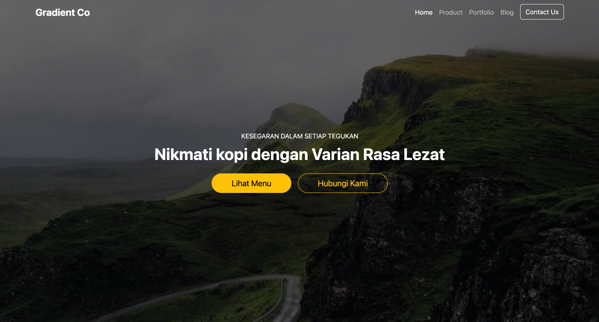
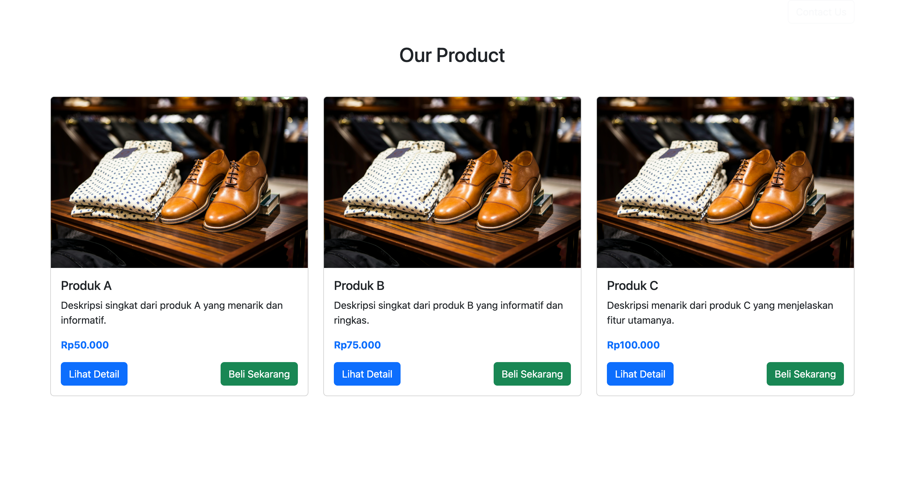
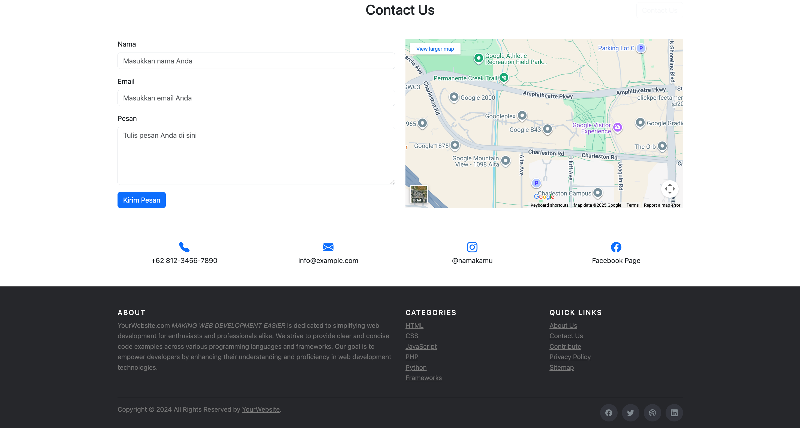
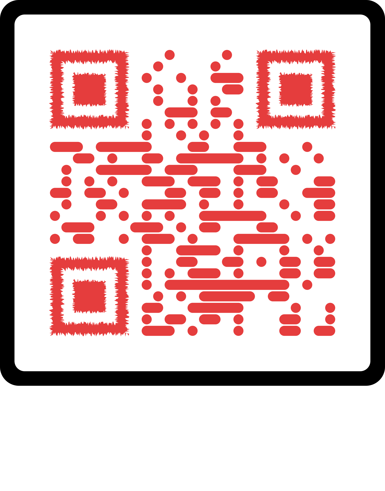

# Bootstrap Site
*Ottobre 2025* 👩🏻‍💻

---












---

⚒️

|    Nome   | Linguaggio | Versione |
|-----------|------------|----------|
|   HTML    |  Markup    |   5      |
|   CSS     |  Style     |   4      |
| BOOTSTRAP | Open Source|   5      |

---

👩🏻‍💻

```
Avviare Golive da VSCode
